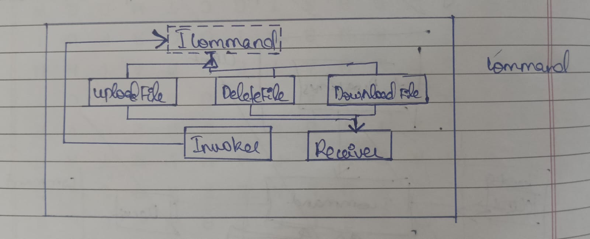

---

# Command System Design Pattern

The Command Design Pattern is a behavioral pattern used to encapsulate a request as an object. It separates the responsibility of issuing commands from the responsibility of executing them. This pattern involves four main components:

1. **ICommand**: An interface that declares a method for executing the command.
2. **CommandImplementation**: Implements the Command interface and defines the binding between a receiver object and an action.
3. **Client**: Creates a CommandImplementation object and sets its receiver.
4. **Invoker/Sender**: Asks the command to execute the request.
5. **Receiver**: Knows how to perform the operation to satisfy a request.

This pattern is useful for implementing undo/redo functionality, queuing operations, or logging changes. It promotes loose coupling between the sender and the receiver of the request.

## Project Overview

The project showcases how to apply the Command Pattern to three common file operations:
- Deleting a file
- Uploading a file
- Downloading a file

## Files

- **ICommand.cs**: Defines the command interface with an 'Execute' method.
- **FileOperationInvoker.cs**: Manages command execution by holding and invoking commands.
- **DeleteFileCommand.cs**: Implements a command to delete a file.
- **UploadFileCommand.cs**: Implements a command to upload a file.
- **DownloadFileCommand.cs**: Implements a command to download a file.
- **Test Cases**

## Class Diagram

The following class diagram shows how the command pattern is implemented in this example of doing basic file operations.

